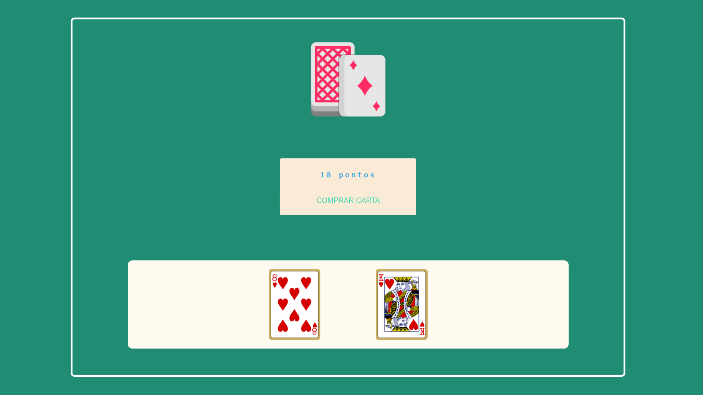
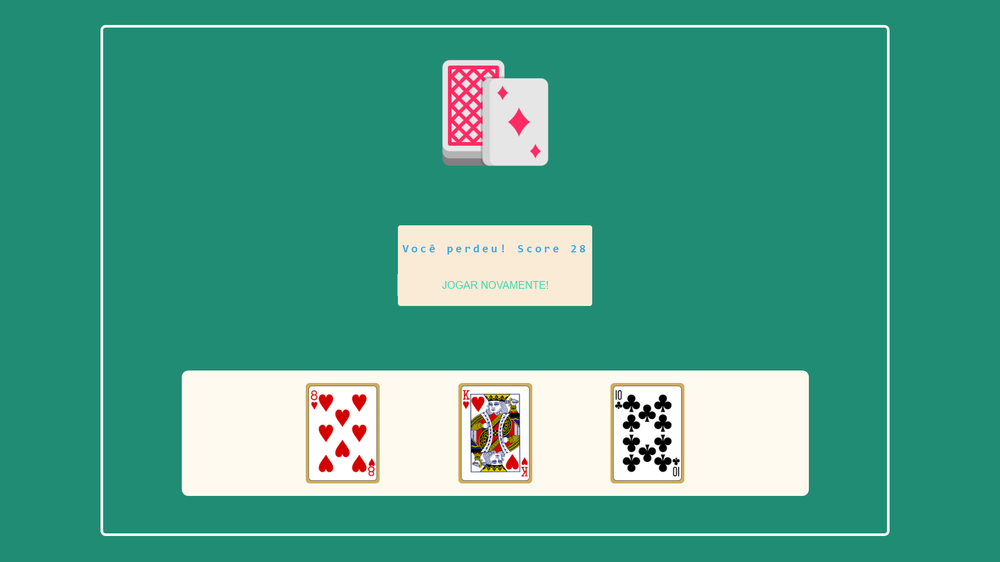
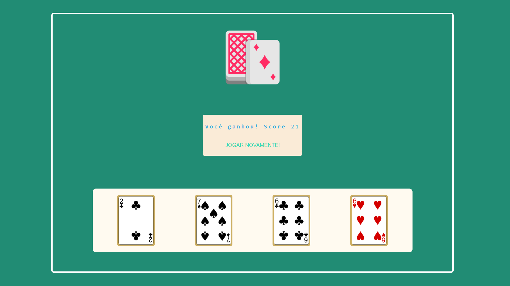

# BLACKJACK

Implementação do famoso jogos de cartas blackjack, talvez alguns conheçam como '21'.

Toda a geração de deck e sortei das cartas foi feita utilizando a <a href="https://deckofcardsapi.com/" target="_blank">deck of cards api</a>

### Tecnologias utilizadas

<ul>
  <li><strong>HTML</strong></li>
  <li><strong>CSS</strong></li>
  <li><strong>JavaScript</strong></li>
</ul>

Deploy no github pages: <a href="https://jose-isaac.github.io/blackjack/">aqui</a>

### Conceitos praticados

<ul>
  <li>Manipulação do <strong>DOM</strong></li>
  <li>Requisições a <strong>API</strong></li>
  <li>Funções <strong>async/await</strong></li>
</ul>

 

<h2 style="text-align: center">Printscreen do Game</h2>

 

<h4>Tela inicial</h4>

 

<h4>' jogador perdeu! '</h4>

 

<h4>' jogador ganhou! '</h4>

